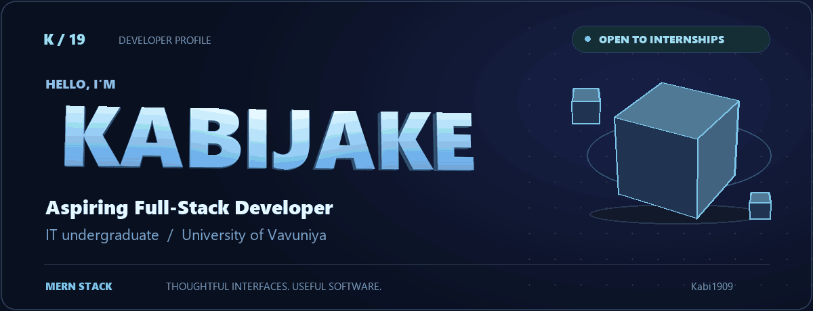
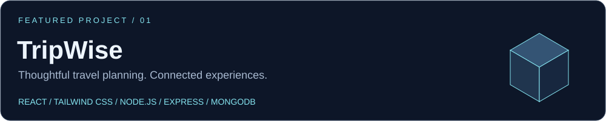
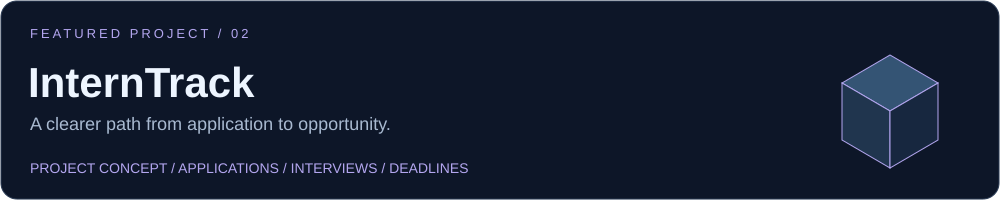

<picture>
  <source media="(prefers-reduced-motion: reduce)" srcset="./assets/kabijake-3d.png">
  
</picture>

  
  
  

  <a href="#user-content-about-me">About</a> ·
  <a href="#user-content-skills--tools">Skills</a> ·
  <a href="#user-content-featured-projects">Projects</a> ·
  <a href="#user-content-github-activity">Activity</a> ·
  <a href="#user-content-lets-connect">Contact</a>

## About me

**Kabijake · IT undergraduate · University of Vavuniya**

I'm an Information Technology undergraduate at the **University of Vavuniya**, building my skills in full-stack web development. I enjoy connecting clear, responsive interfaces with practical APIs and well-structured databases.

My current focus is the **MERN stack: MongoDB, Express, React, and Node.js**. I'm interested in internship opportunities and collaborative projects where I can contribute, learn from feedback, and develop as a software engineer.

## Skills & tools

Technologies I work with and continue to develop through coursework and personal projects.

**Languages**

**Frontend**

**Backend & databases**

**Development tools**

## Featured projects

### [TripWise — Travel planning platform](https://github.com/Kabi1909/TripWise)

A full-stack application for exploring Sri Lankan destinations and coordinating personalized trips between travelers and travel agents.

- Traveler and agent portals for trip requests, itineraries, bookings, and messages.
- Built with **React, Tailwind CSS, Node.js, Express, and MongoDB**.
- Practical experience connecting user interfaces, authenticated APIs, and database models.

[Explore the repository →](https://github.com/Kabi1909/TripWise)

### InternTrack — Internship application tracker

A project concept focused on helping students and graduates organize internship applications, interviews, and deadlines in one place.

**Focus:** application tracking, clear status updates, and a straightforward user experience.

*Public repository link to be added when available.*

## What I'm learning next

- Build maintainable MERN applications with reusable components and clear API contracts.
- Strengthen REST API design, authentication, validation, and database modeling.
- Improve testing, debugging, accessibility, and responsive interface design.
- Deepen my Java and Spring Boot knowledge alongside JavaScript development.
- Explore AI and deep learning fundamentals while strengthening core software engineering skills.

## GitHub activity

  
  

### My contributions, in 3D

<picture>
  <source media="(prefers-reduced-motion: reduce)" srcset="./profile-3d-contrib/profile-green.svg">
  <source media="(prefers-color-scheme: dark)" srcset="./profile-3d-contrib/profile-night-rainbow.svg">
  
</picture>

### One contribution at a time

<picture>
  <source media="(prefers-color-scheme: dark)" srcset="./assets/github-snake-dark.svg">
  
</picture>

Activity cards and contribution artwork refresh daily. Language totals describe repository contents, not proficiency.

## Let's connect

Interested in a **full-stack development internship**, a student project, or a collaboration? I'd be happy to connect.

**Email:** [kabijakep@gmail.com](mailto:kabijakep@gmail.com)

**Let's build something useful, and keep learning along the way.**
